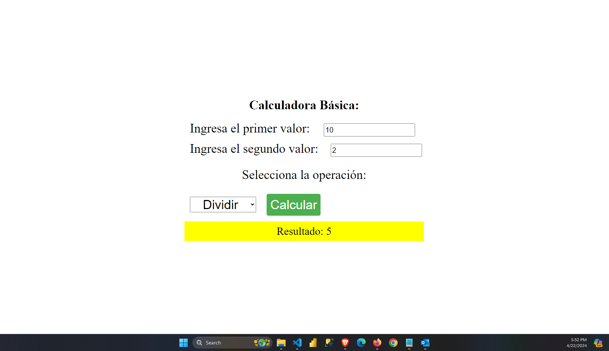
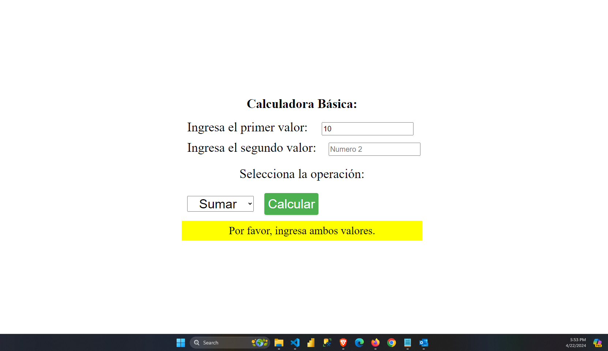
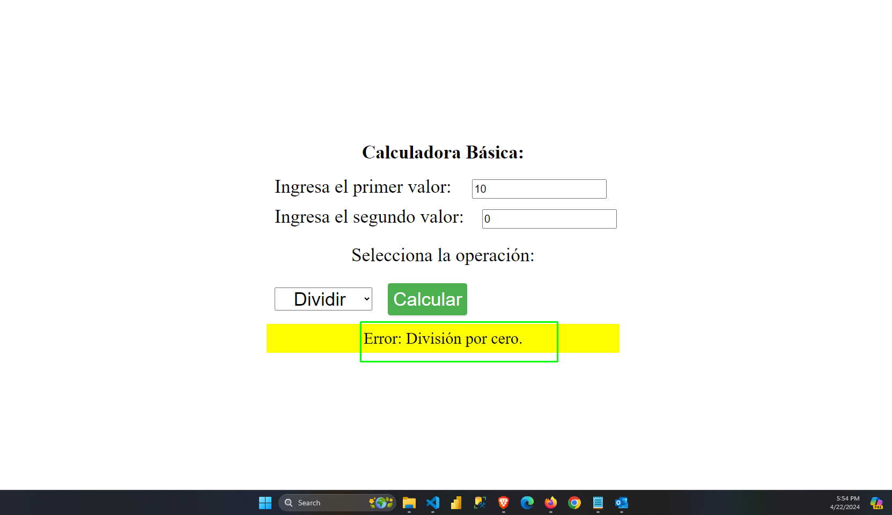

# Calculadora Básica
---
¡Bienvenido al proyecto de la **Calculadora Básica**! Este proyecto es una aplicación simple pero útil que permite realizar operaciones aritméticas básicas como suma, resta, multiplicación y división. El objetivo del proyecto es brindar un recurso educativo para aprender sobre el desarrollo web y prácticas de codificación.

## Descripción del Proyecto
---
El proyecto consta de un archivo HTML, CSS y JavaScript que trabajan juntos para crear una calculadora funcional. La interfaz del usuario incluye campos de entrada para los valores numéricos, un selector de operaciones, y un botón para calcular el resultado. El resultado se muestra de manera clara y accesible para el usuario.

## Tecnologías Utilizadas
---
- HTML: Estructura la página web.
- CSS: Estiliza y proporciona diseño a la interfaz de usuario.
- JavaScript: Maneja la lógica de la calculadora y las interacciones del usuario.

## Visitar el Sitio

Puedes ver la calculadora en acción haciendo clic en el siguiente enlace:

[Visitar este Sitio](https://juancitopena.github.io/CALCULADORA_BASICA_HTML_CSS_JS/)

## Portada:
---

## Portada Valores Vacios:

## Portada Division entre o:

## Finalidad del Proyecto
---
Este proyecto es ideal para aprender y practicar habilidades básicas en desarrollo web. Los temas tratados incluyen:

- Manipulación del DOM con JavaScript.
- Estilizado responsivo con CSS y media queries.
- Creación de una interfaz de usuario básica pero funcional.
- Validaciones y manejo de errores para operaciones aritméticas.

---
# Descripción del Algoritmo
---
Este algoritmo JavaScript es parte de una aplicación web que permite a los usuarios realizar cálculos matemáticos básicos. A través de un formulario, los usuarios pueden ingresar dos valores numéricos y seleccionar el tipo de operación matemática que desean realizar. Aquí están los pasos clave que sigue el algoritmo:

## Paso 1: Obtener Referencias de Entrada
El algoritmo obtiene referencias a elementos de entrada en el documento HTML:
- `valor1Input`: Campo de entrada para el primer valor numérico.
- `valor2Input`: Campo de entrada para el segundo valor numérico.
- `operacionSelect`: Selector para elegir el tipo de operación (suma, resta, multiplicación o división).
- `resultadoP`: Párrafo donde se mostrará el resultado.

## Paso 2: Recuperar y Convertir los Valores
Los valores ingresados por el usuario se recuperan y convierten a números utilizando `parseFloat`. Esta conversión es esencial para realizar cálculos matemáticos.

## Paso 3: Validación de los Datos
El algoritmo verifica si los valores convertidos son válidos (no son `NaN`). Si cualquiera de los valores es inválido, se muestra un mensaje de error en el elemento `resultadoP` y se detiene la ejecución para evitar cálculos incorrectos.

## Paso 4: Aplicar la Operación Matemática
El algoritmo utiliza un bloque `switch` para determinar la operación matemática a aplicar:
- **Suma**: Se suman los valores ingresados.
- **Resta**: Se restan los valores ingresados.
- **Multiplicación**: Se multiplican los valores ingresados.
- **División**: Se divide el primer valor por el segundo, con una comprobación para evitar división por cero.

Si la operación no es reconocida, se muestra un mensaje de error y la ejecución se detiene para evitar errores.

## Paso 5: Mostrar el Resultado
Una vez completada la operación, el algoritmo muestra el resultado en el párrafo de resultados (`resultadoP`). Si ocurre un error o la operación es desconocida, se muestra un mensaje de error para notificar al usuario.

## Ejemplo de Uso
Para usar este algoritmo, el usuario debe:
1. Ingresar dos valores numéricos en los campos `valor1Input` y `valor2Input`.
2. Seleccionar una operación matemática en `operacionSelect`.
3. Hacer clic en el botón de cálculo para obtener el resultado, que se mostrará en el párrafo `resultadoP`.

Si alguno de los valores es inválido, o si se intenta dividir por cero, el algoritmo mostrará un mensaje de error para indicar el problema.
---

## Cómo Clonar el Repositorio
---
Puedes clonar el repositorio para explorar el código y experimentar con tus propias modificaciones. Para clonar el repositorio, usa el siguiente comando:

---
git clone: https://github.com/JUANCITOPENA/CALCULADORA_BASICA_HTML_CSS_JS.git

---
## Compartir y Contribuir

Te animamos a compartir este proyecto con tus amigos y colegas. Si deseas contribuir, puedes hacer un fork del repositorio y enviar pull requests con tus mejoras o correcciones. ¡Nos encantaría ver tus contribuciones!

## Licencia

Este proyecto está bajo la Licencia MIT, lo que significa que puedes usar, modificar y distribuir el código libremente. Para más detalles, consulta el archivo LICENSE.

---
## Redes Sociales:
---
No olvides suscribirte, darle like, y compartir este video para ayudarnos a seguir creando contenido como este. ¡Vamos a comenzar! 😊📡

1. 🎬 **YouTube**: [@JuancitoPenaV](https://www.youtube.com/@JuancitoPenaV)

2. 👨‍💼 **LinkedIn**: [Juancito Peña](https://www.linkedin.com/in/juancitope%C3%B1a/)

3. 📰 **Blog**: [Adviser Tecnology](https://advisertecnology.com/)

4. 📷 **Instagram**: [@juancito.pena.v](https://www.instagram.com/juancito.pena.v/)

5. 📑 **Facebook**: [Juancito Peña V](https://www.facebook.com/juancito.p.v)

6. 🐦 **Twitter**: [@JuancitoPenaV](https://twitter.com/JuancitoPenaV)

7. 📰 **Blog**: [Adviser Tecnology](https://advisertecnology.com/)

¡Gracias por tu interés en el proyecto! No dudes en contactarme si tienes alguna pregunta o sugerencia.
